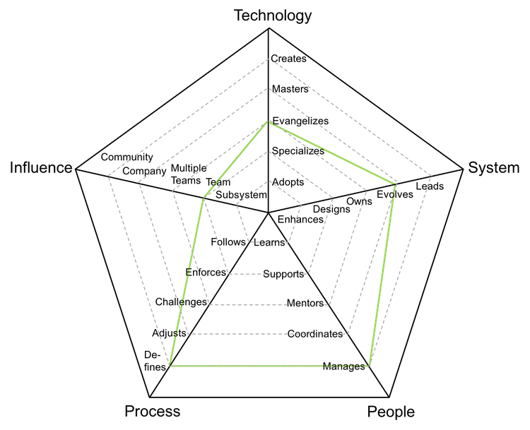

# TIPPS Framework

TIPPS framework helps engineers setting expectations from their role and transitioning to the next level in their career progression.

# Axes

The chart shown above has the following 5 axes:
* **Technology**: knowledge of the tech stack and tools
* **Influence**: scope of influence of the position
* **People**: relationship with the team(s)
* **Process**: level of engagement with the development process
* **System**: level of ownership of the system(s)

Each axis has 5 different levels of performance. It is important to highlight that every level includes the previous one(s). For example, someone that *evangelizes* technology, *specializes* and *adopts* it as well.

# Career paths

The framework has 3 different paths:

* **Maker**: is also known as individual contributor or software engineer, requires a deep level of technical expertise
* **Leader**: is also known as tech lead, is the owner of the system and requires a unique balance between hands-on development, architecture knowledge and production support
* **Manager**: is also known as engg manager, is responsible for the consistent delivery, career growth and level of happiness of the team

| Level | Maker | Leader | Manager |
| :---: | :---: | :---: |  :---: |
| L1 | [Software Engineer I](TIPPS.md#software-engineer-i) | | |
| L2 | [Software Engineer II](TIPPS.md#software-engineer-ii) | | |
| L3 | [Senior Software Engineer I](TIPPS.md#senior-software-engineer-i) | | |
| L4 | [Senior Software Engineer II](TIPPS.md#senior-software-engineer-ii) | [Tech Lead](TIPPS.md#tech-lead) | |
| L5 | [Staff Engineer](TIPPS.md#staff-engineer) | [Senior Tech Lead](TIPPS.md#senior-tech-lead) | [Engineering Manager](TIPPS.md#engineering-manager) |
| L6 | [Senior Staff Engineer](TIPPS.md#senior-staff-engineer) | [Architect](TIPPS.md#architect) | [Director of Engineering](TIPPS.md#director-of-engineering) |
| L7 | [Principal Engineer](TIPPS.md#principal-engineer) | [Senior Architect](TIPPS.md#senior-architect) | [VP of engineering](TIPPS.md#vp-of-engineering) |

## Software Engineer I

* **Adopts**: actively learns and adopts the technology and tools defined by the team
* **Enhances**: successfully pushes new features and bug fixes to improve and extend the system
* **Learns**: quickly learns from others and consistently steps up when it is required
* **Follows**: follows the team processes, delivering a consistent flow of features to production
* **Subsystem**: makes an impact on one or more subsystems or team pods

## Software Engineer II

* **Adopts**: actively learns and adopts the technology and tools defined by the team
* **Designs**: designs and implements medium to large size features while reducing the system's tech debt
* **Supports**: proactively supports other team members and helps them to be successful
* **Enforces**: enforces the team processes, making sure everybody understands the benefits and tradeoffs
* **Subsystem**: makes an impact on one or more subsystems or team pods

## Senior Software Engineer I

* **Specializes**: is the go-to person for one or more technologies and takes initiative to learn new ones
* **Designs**: designs and implements medium to large size features while reducing the system's tech debt
* **Supports**: proactively supports other team members and helps them to be successful
* **Challenges**: challenges the team processes, looking for ways to improve them
* **Team**: makes an impact on the whole team, not just on specific parts of it

## Senior Software Engineer II

* **Evangelizes**: researches, creates proofs of concept and introduces new technologies to the team
* **Owns**: owns the production operation and monitoring of the system and is aware of its SLAs
* **Mentors**: mentors others to accelerate their career-growth and encourages them to participate
* **Challenges**: challenges the team processes, looking for ways to improve them
* **Team**: makes an impact on the whole team, not just on specific parts of it

## Staff Engineer

* **Masters**: has very deep knowledge about the whole technology stack of the system
* **Evolves**: evolves the architecture to support future requirements and defines its SLAs
* **Mentors**: mentors others to accelerate their career-growth and encourages them to participate
* **Adjusts**: adjusts the team processes, listening to feedback and guiding the team through the changes
* **Multiple Teams**: makes an impact not only on the whole team but also on other teams

## Senior Staff Engineer

* **Creates**: designs and creates new technologies that are widely used either by internal or external teams
* **Leads**: leads the technical excellence of the system and creates plans to mitigate outages
* **Mentors**: mentors others to accelerate their career-growth and encourages them to participate
* **Adjusts**: adjusts the team processes, listening to feedback and guiding the team through the changes
* **Company**: makes an impact on the whole tech organization

## Principal Engineer

* **Creates**: designs and creates new technologies that are widely used either by internal or external teams
* **Leads**: leads the technical excellence of the system and creates plans to mitigate outages
* **Mentors**: mentors others to accelerate their career-growth and encourages them to participate
* **Adjusts**: adjusts the team processes, listening to feedback and guiding the team through the changes
* **Community**: makes an impact on the tech community

## Tech Lead

* **Specializes**: is the go-to person for one or more technologies and takes initiative to learn new ones
* **Owns**: owns the production operation and monitoring of the system and is aware of its SLAs
* **Coordinates**: coordinates team members providing effective feedback and moderating discussions
* **Adjusts**: adjusts the team processes, listening to feedback and guiding the team through the changes
* **Subsystem**: makes an impact on one or more subsystems or team pods

## Senior Tech Lead

* **Evangelizes**: researches, creates proofs of concept and introduces new technologies to the team
* **Evolves**: evolves the architecture to support future requirements and defines its SLAs
* **Coordinates**: coordinates team members providing effective feedback and moderating discussions
* **Defines**: defines the right processes for the team's maturity level, balancing agility and discipline
* **Team**: makes an impact on the whole team, not just on specific parts of it

## Architect

* **Masters**: has very deep knowledge about the whole technology stack of the system
* **Leads**: leads the technical excellence of the system and creates plans to mitigate outages
* **Coordinates**: coordinates team members providing effective feedback and moderating discussions
* **Defines**: defines the right processes for the team's maturity level, balancing agility and discipline
* **Multiple Teams**: makes an impact not only on the whole team but also on other teams

## Senior Architect

* **Masters**: has very deep knowledge about the whole technology stack of the system
* **Leads**: leads the technical excellence of the system and creates plans to mitigate outages
* **Coordinates**: coordinates team members providing effective feedback and moderating discussions
* **Defines**: defines the right processes for the team's maturity level, balancing agility and discipline
* **Company**: makes an impact on the whole tech organization

## Engineering Manager

* **Evangelizes**: researches, creates proofs of concept and introduces new technologies to the team
* **Owns**: owns the production operation and monitoring of the system and is aware of its SLAs
* **Manages**: manages the team members' career, expectations, performance and level of happiness
* **Adjusts**: adjusts the team processes, listening to feedback and guiding the team through the changes
* **Team**: makes an impact on the whole team, not just on specific parts of it

## Director of Engineering

* **Evangelizes**: researches, creates proofs of concept and introduces new technologies to the team
* **Evolves**: evolves the architecture to support future requirements and defines its SLAs
* **Manages**: manages the team members' career, expectations, performance and level of happiness
* **Defines**: defines the right processes for the team's maturity level, balancing agility and discipline
* **Team**: makes an impact on the whole team, not just on specific parts of it

## VP of Engineering

* **Evangelizes**: researches, creates proofs of concept and introduces new technologies to the team
* **Evolves**: evolves the architecture to support future requirements and defines its SLAs
* **Manages**: manages the team members' career, expectations, performance and level of happiness
* **Defines**: defines the right processes for the team's maturity level, balancing agility and discipline
* **Multiple Teams**: makes an impact not only on the whole team but also on other teams

# Tech Lead vs Engineering Manager

It is very common for companies to mix the Tech Lead and Engineering Manager roles. Although both roles have some overlap, their focus is different: the Tech Lead is in charge of the *System* while the Engineering Manager is in charge of the *People*.

If the team is small and/or the leader has a lot of experience as Engineering Manager and Tech Lead, the same person might perform both roles. But as the system and team grow in size and complexity, there might be an opportunity to have different people for each role.

The following is a non-exhaustive list that exemplifies some of the different responsibilities of each role:

| Tech Lead (System) | Engineering Manager (People)|
| :--- | :--- |
| Technical Excellence and Innovation| Career Planning, Promotions and Coaching |
| Architecture and System Integration | Headcount Planning and Hiring |
| Tech Mentoring, Adoption and Alignment | Team Planning and Delivery |
| Technical Spikes and Experiments​ | Objectives, Performance and Feedback |
| Code Reviews and Feedback | One on Ones |
| System Design Presentations​ | Participation in Technical Decisions |
| Technical Capacity Planning​ | Cascading Communications​ |
| Production Issues Escalation​ | Team Building Activities and Culture​ |
| System SLAs, Metrics & Monitoring​ | Team Protection and Happiness​ |
| Platform Direction, Patterns and Practices | Team Productivity and Metrics​ |
| Alignment with other Tech Leads​ | Alignment with other Dev Managers​ |
| Hands-On Coding 30% to 70% of the Time | Hands-On Coding 0% to 30% of the Time |
| System Roadmap (shared)​ | System Roadmap (shared)​ |
| Development Process (shared)​ | Development Process (shared)​ |
| Team Visibility and Recognition (shared) | Team Visibility and Recognition (shared)​ |
| Ability to Act as Engineering Manager when Required | Ability to Act as Tech Lead when Required |

The last point on each role highlights the fact that the lists are not mutually exclusive, and therefore many of the points from one side are also important on the other side too. An Engineering Manager that can't understand the technical challenges that the team is facing won't be successful at the role, the same is true for a Tech Lead that doesn't understand the career paths of the engineers in the team. 

Having said that, although it is important for an Engineering Manager to be able act as a Tech Lead and vice versa, it also critical for them to focus and excel at the right things. Although there is a clear overlap and an opportunity for collaboration, both positions must know well who is responsible for what to avoid conflicts and misunderstandings.
