# TIPPS Framework

TIPPS framework sets expectations of each position and helps transitioning to the next level in their career.

# Axes

The chart shown above has the following 5 axes:
* **Technology**: knowledge of the tech stack and tools
* **Influence**: scope of influence of the position
* **People**: relationship with the team(s)
* **Process**: level of engagement with the development process
* **System**: level of ownership of the system(s)

Each axis has 5 different levels of performance. It is important to highlight that every level includes the previous one(s). For example, someone that *evangelizes* technology, *specializes* and *adopts* it as well.

# Levels

## Technology

1. **Adopts**: actively learns and adopts the technology and tools defined by the team
2. **Specializes**: is the go-to person for one or more technologies and takes initiative to learn new ones
3. **Evangelizes**: researches, creates proofs of concept and introduces new technologies to the team
4. **Masters**: has very deep knowledge about the whole technology stack of the system
5. **Creates**: designs and creates new technologies that are widely used either by internal or external teams

## System

1. **Enhances**: successfully pushes new features and bug fixes to improve and extend the system
2. **Designs**: designs and implements medium to large size features while reducing the system's tech debt
3. **Owns**: owns the production operation and monitoring of the system and is aware of its SLAs
4. **Evolves**: evolves the architecture to support future requirements and defines its SLAs
5. **Leads**: leads the technical excellence of the system and creates plans to mitigate outages

## People

1. **Learns**: quickly learns from others and consistently steps up when it is required
2. **Supports**: proactively supports other team members and helps them to be successful
3. **Mentors**: mentors others to accelerate their career-growth and encourages them to participate
4. **Coordinates**: coordinates team members providing effective feedback and moderating discussions
5. **Manages**: manages the team members' career, expectations, performance and level of happiness

## Process

1. **Follows**: follows the team processes, delivering a consistent flow of features to production
2. **Enforces**: enforces the team processes, making sure everybody understands the benefits and tradeoffs
3. **Challenges**: challenges the team processes, looking for ways to improve them
4. **Adjusts**: adjusts the team processes, listening to feedback and guiding the team through the changes
5. **Defines**: defines the right processes for the team's maturity level, balancing agility and discipline

## Influence

1. **Subsystem**: makes an impact on one or more subsystems
2. **Team**: makes an impact on the whole team, not just on specific parts of it
3. **Multiple Teams**: makes an impact not only his/her team but also on other teams
4. **Company**: makes an impact on the whole tech organization
5. **Community**: makes an impact on the tech community

The framework has 4 different ladders:

* [**Developer**](Developer.md): role also known as programmer or software engineer, requires a deep level of technical expertise
* [**Tech Lead**](TechLead.md): role also known as dev lead, is the owner of the system and requires a unique balance between hands-on development, architecture knowledge and production support
* [**Technical Program Manager**](TechnicalProgramManager.md): role responsible for coordinating and driving to completion initiatives that expand multiple teams
* [**Engineering Manager**](EngineeringManager.md): role also known as dev manager, is responsible for the consistent delivery, career growth and level of happiness of the team

| Level | Seniority | [Developer](Developer.md) | [Tech Lead](TechLead.md) | [Technical Program Manager](TechnicalProgramManager.md) | [Engineering Manager](EngineeringManager.md) |
| :---: | :---: | :---: | :---: | :---: |  :---: |
| 1 | Junior | [D1](TIPPS.md#d1---developer-1) | | | |
| 2 | Junior | [D2](TIPPS.md#d2---developer-2) | | | |
| 3 | Junior | [D3](TIPPS.md#d3---developer-3) | | | |
| 4 | Senior | [D4](TIPPS.md#d4---developer-4) | [TL4](TIPPS.md#tl4---tech-lead-4) | [TPM4](TIPPS.md#tpm4---technical-program-manager-4) | |
| 5 | Senior | [D5](TIPPS.md#d5---developer-5) | [TL5](TIPPS.md#tl5---tech-lead-5) | [TPM5](TIPPS.md#tpm5---technical-program-manager-5) | [EM5](TIPPS.md#em5---engineering-manager-5) |
| 6 | Senior | [D6](TIPPS.md#d6---developer-6) | [TL6](TIPPS.md#tl6---tech-lead-6) | [TPM6](TIPPS.md#tpm6---technical-program-manager-6) | [EM6](TIPPS.md#em6---engineering-manager-6) |
| 7 | Senior | [D7](TIPPS.md#d7---developer-7) | [TL7](TIPPS.md#tl7---tech-lead-7) | [TPM7](TIPPS.md#tpm7---technical-program-manager-7) | [EM7](TIPPS.md#em7---engineering-manager-7) |

## D1 - Developer 1

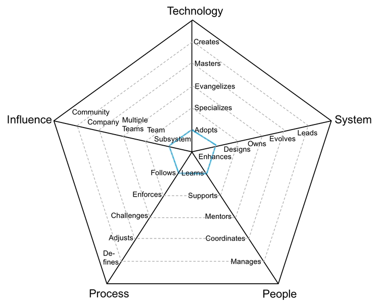

* **Adopts**: actively learns and adopts the technology and tools defined by the team
* **Enhances**: successfully pushes new features and bug fixes to improve and extend the system
* **Learns**: quickly learns from others and consistently steps up when it is required
* **Follows**: follows the team processes, delivering a consistent flow of features to production
* **Subsystem**: makes an impact on one or more subsystems or team pods

## D2 - Developer 2

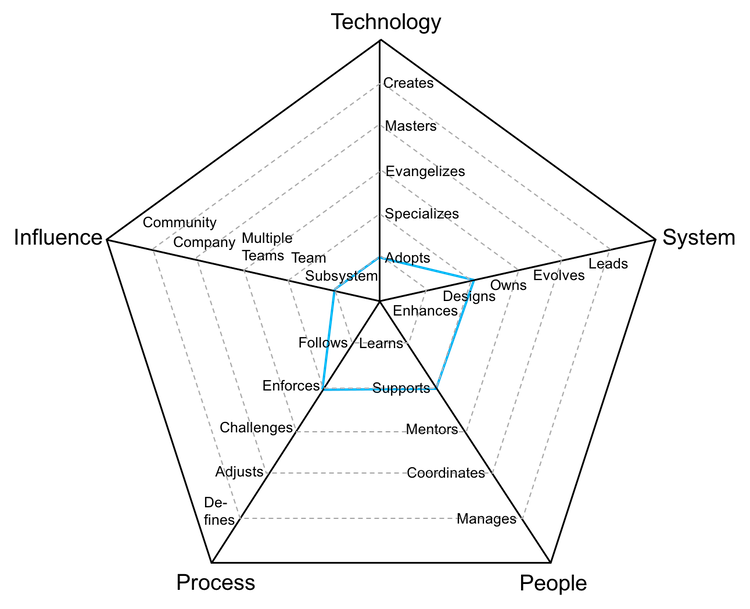

* **Adopts**: actively learns and adopts the technology and tools defined by the team
* **Designs**: designs and implements medium to large size features while reducing the system's tech debt
* **Supports**: proactively supports other team members and helps them to be successful
* **Enforces**: enforces the team processes, making sure everybody understands the benefits and tradeoffs
* **Subsystem**: makes an impact on one or more subsystems or team pods

## D3 - Developer 3

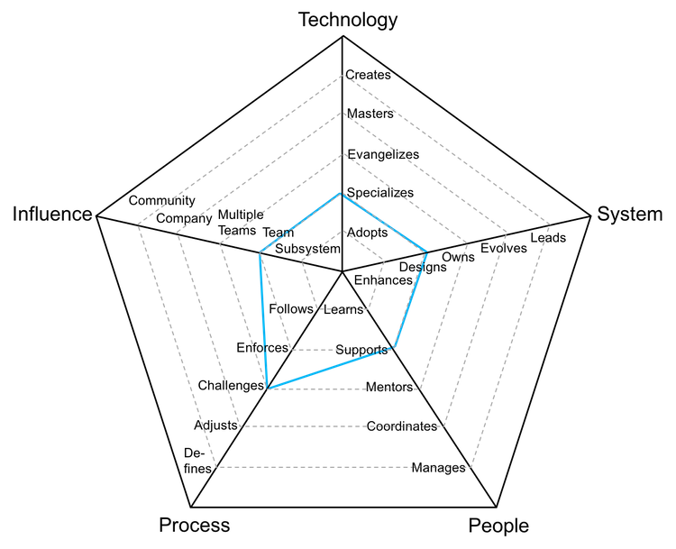

* **Specializes**: is the go-to person for one or more technologies and takes initiative to learn new ones
* **Designs**: designs and implements medium to large size features while reducing the system's tech debt
* **Supports**: proactively supports other team members and helps them to be successful
* **Challenges**: challenges the team processes, looking for ways to improve them
* **Team**: makes an impact on the whole team, not just on specific parts of it

## D4 - Developer 4

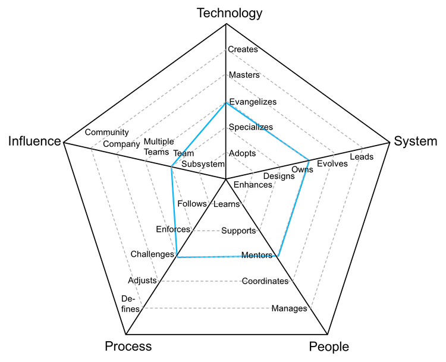

* **Evangelizes**: researches, creates proofs of concept and introduces new technologies to the team
* **Owns**: owns the production operation and monitoring of the system and is aware of its SLAs
* **Mentors**: mentors others to accelerate their career-growth and encourages them to participate
* **Challenges**: challenges the team processes, looking for ways to improve them
* **Team**: makes an impact on the whole team, not just on specific parts of it

## D5 - Developer 5

* **Masters**: has very deep knowledge about the whole technology stack of the system
* **Evolves**: evolves the architecture to support future requirements and defines its SLAs
* **Mentors**: mentors others to accelerate their career-growth and encourages them to participate
* **Adjusts**: adjusts the team processes, listening to feedback and guiding the team through the changes
* **Multiple Teams**: makes an impact not only on the whole team but also on other teams

## D6 - Developer 6

* **Creates**: designs and creates new technologies that are widely used either by internal or external teams
* **Leads**: leads the technical excellence of the system and creates plans to mitigate outages
* **Mentors**: mentors others to accelerate their career-growth and encourages them to participate
* **Adjusts**: adjusts the team processes, listening to feedback and guiding the team through the changes
* **Company**: makes an impact on the whole tech organization

## D7 - Developer 7

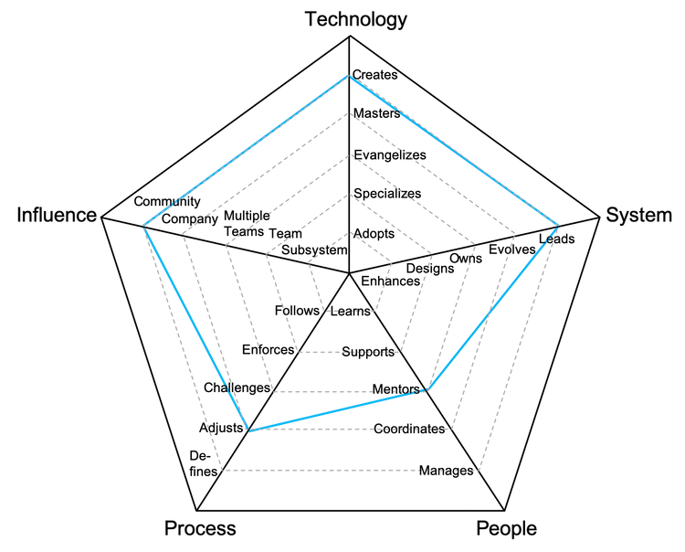

* **Creates**: designs and creates new technologies that are widely used either by internal or external teams
* **Leads**: leads the technical excellence of the system and creates plans to mitigate outages
* **Mentors**: mentors others to accelerate their career-growth and encourages them to participate
* **Adjusts**: adjusts the team processes, listening to feedback and guiding the team through the changes
* **Community**: makes an impact on the tech community

## TL4 - Tech Lead 4

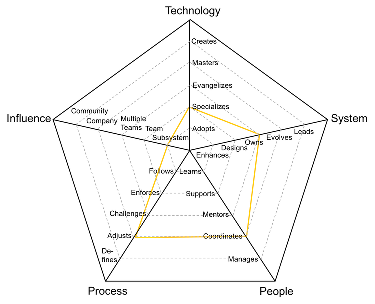

* **Specializes**: is the go-to person for one or more technologies and takes initiative to learn new ones
* **Owns**: owns the production operation and monitoring of the system and is aware of its SLAs
* **Coordinates**: coordinates team members providing effective feedback and moderating discussions
* **Adjusts**: adjusts the team processes, listening to feedback and guiding the team through the changes
* **Subsystem**: makes an impact on one or more subsystems or team pods

## TL5 - Tech Lead 5

* **Evangelizes**: researches, creates proofs of concept and introduces new technologies to the team
* **Evolves**: evolves the architecture to support future requirements and defines its SLAs
* **Coordinates**: coordinates team members providing effective feedback and moderating discussions
* **Defines**: defines the right processes for the team's maturity level, balancing agility and discipline
* **Team**: makes an impact on the whole team, not just on specific parts of it

## TL6 - Tech Lead 6

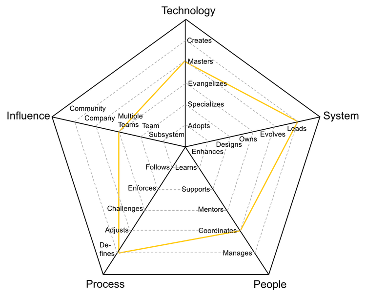

* **Masters**: has very deep knowledge about the whole technology stack of the system
* **Leads**: leads the technical excellence of the system and creates plans to mitigate outages
* **Coordinates**: coordinates team members providing effective feedback and moderating discussions
* **Defines**: defines the right processes for the team's maturity level, balancing agility and discipline
* **Multiple Teams**: makes an impact not only on the whole team but also on other teams

## TL7 - Tech Lead 7

* **Masters**: has very deep knowledge about the whole technology stack of the system
* **Leads**: leads the technical excellence of the system and creates plans to mitigate outages
* **Coordinates**: coordinates team members providing effective feedback and moderating discussions
* **Defines**: defines the right processes for the team's maturity level, balancing agility and discipline
* **Company**: makes an impact on the whole tech organization

## TPM4 - Technical Program Manager 4

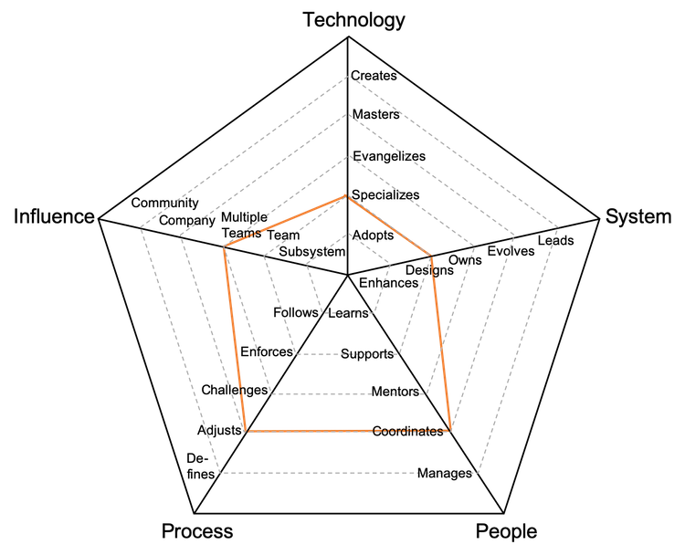

* **Specializes**: is the go-to person for one or more technologies and takes initiative to learn new ones
* **Designs**: designs and implements medium to large size features while reducing the system's tech debt
* **Coordinates**: coordinates team members providing effective feedback and moderating discussions
* **Adjusts**: adjusts the team processes, listening to feedback and guiding the team through the changes
* **Multiple Teams**: makes an impact not only on the whole team but also on other teams

## TPM5 - Technical Program Manager 5

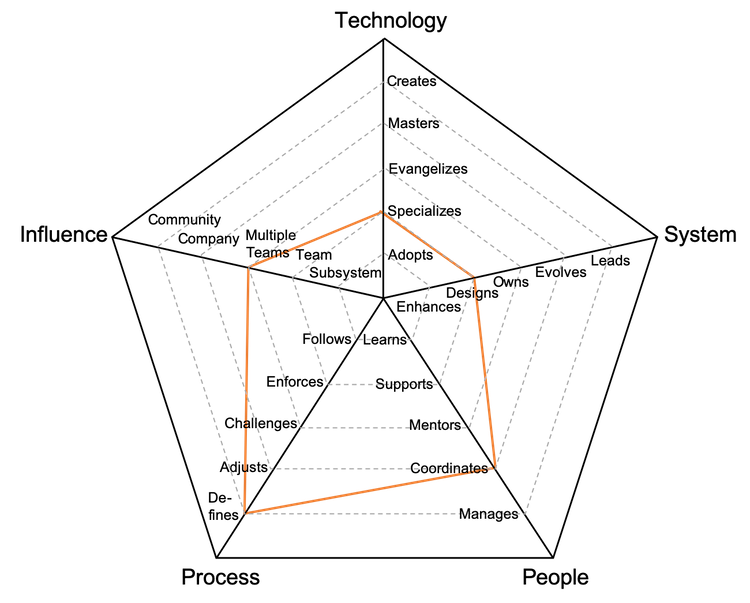

* **Specializes**: is the go-to person for one or more technologies and takes initiative to learn new ones
* **Designs**: designs and implements medium to large size features while reducing the system's tech debt
* **Coordinates**: coordinates team members providing effective feedback and moderating discussions
* **Defines**: defines the right processes for the team's maturity level, balancing agility and discipline
* **Multiple Teams**: makes an impact not only on the whole team but also on other teams

## TPM6 - Technical Program Manager 6

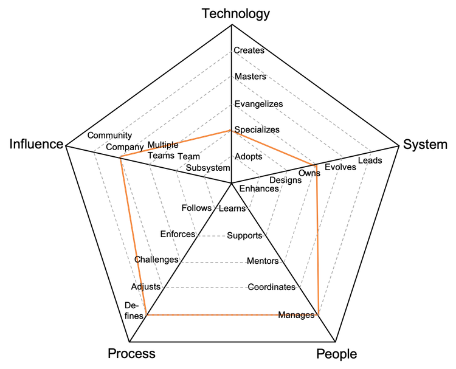

* **Specializes**: is the go-to person for one or more technologies and takes initiative to learn new ones
* **Owns**: owns the production operation and monitoring of the system and is aware of its SLAs
* **Manages**: manages the team members' career, expectations, performance and level of happiness
* **Defines**: defines the right processes for the team's maturity level, balancing agility and discipline
* **Company**: makes an impact on the whole tech organization

## TPM7 - Technical Program Manager 7

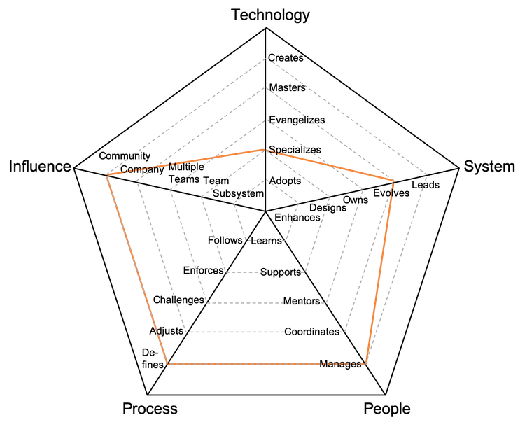

* **Specializes**: is the go-to person for one or more technologies and takes initiative to learn new ones
* **Evolves**: evolves the architecture to support future requirements and defines its SLAs
* **Manages**: manages the team members' career, expectations, performance and level of happiness
* **Defines**: defines the right processes for the team's maturity level, balancing agility and discipline
* **Community**: makes an impact on the tech community

## EM5 - Engineering Manager 5

* **Evangelizes**: researches, creates proofs of concept and introduces new technologies to the team
* **Owns**: owns the production operation and monitoring of the system and is aware of its SLAs
* **Manages**: manages the team members' career, expectations, performance and level of happiness
* **Adjusts**: adjusts the team processes, listening to feedback and guiding the team through the changes
* **Team**: makes an impact on the whole team, not just on specific parts of it

## EM6 - Engineering Manager 6

* **Evangelizes**: researches, creates proofs of concept and introduces new technologies to the team
* **Evolves**: evolves the architecture to support future requirements and defines its SLAs
* **Manages**: manages the team members' career, expectations, performance and level of happiness
* **Defines**: defines the right processes for the team's maturity level, balancing agility and discipline
* **Team**: makes an impact on the whole team, not just on specific parts of it

## EM7 - Engineering Manager 7

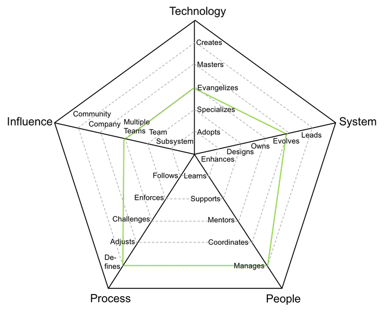

* **Evangelizes**: researches, creates proofs of concept and introduces new technologies to the team
* **Evolves**: evolves the architecture to support future requirements and defines its SLAs
* **Manages**: manages the team members' career, expectations, performance and level of happiness
* **Defines**: defines the right processes for the team's maturity level, balancing agility and discipline
* **Multiple Teams**: makes an impact not only on the whole team but also on other teams
